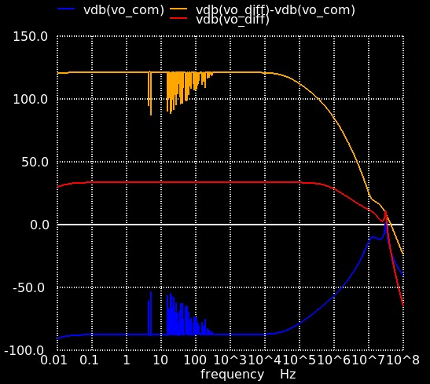

 

# Instrumentation Amplifier for Electrocardiogram Signal Adquisition

- [Read the documentation for project](docs/info.md)

## How it works
An Instrumentation Amplifier (IA) is a circuit that can extract low-level low-frequency differential signals that are embedded in high-level common noise signals. This IA’s ability is due to the value of the Common Mode Rejection Ratio (CMRR) is very high; the CMRR must be grater than 120 dB.  So that, IAs are widely used in biomedical applications, specifically as an analog front-end for electrocardiogram (ECG) data acquisition.

Figure 1 shows how the designed IA must be connected as a 3 leads configuration to a human patient to obtain the unfiltered version of the ECG.

## How it works
Figure 2 shows the top-level bock diagram of the IA with all the inputs an outputs that can be accessed as well as all the hardware thar is needed to perform the CMRR measurements. The purpose of each pin is described as follows:
